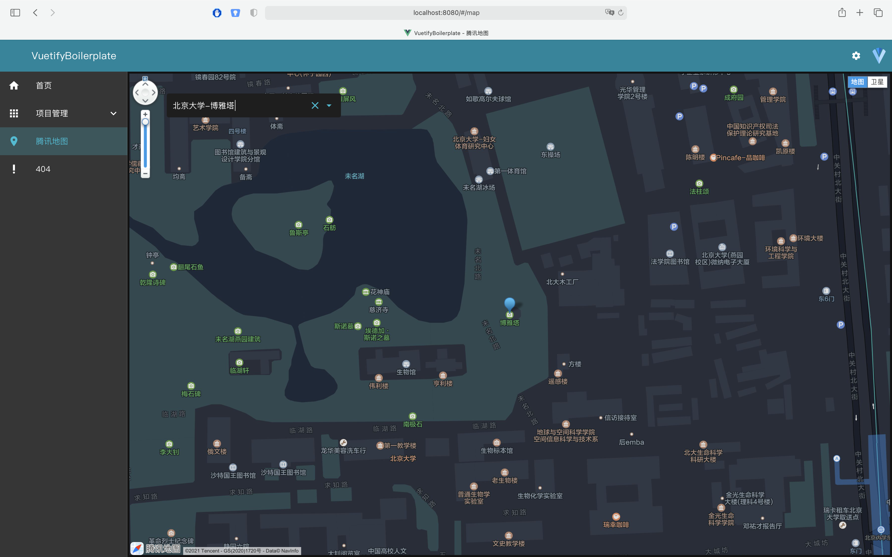
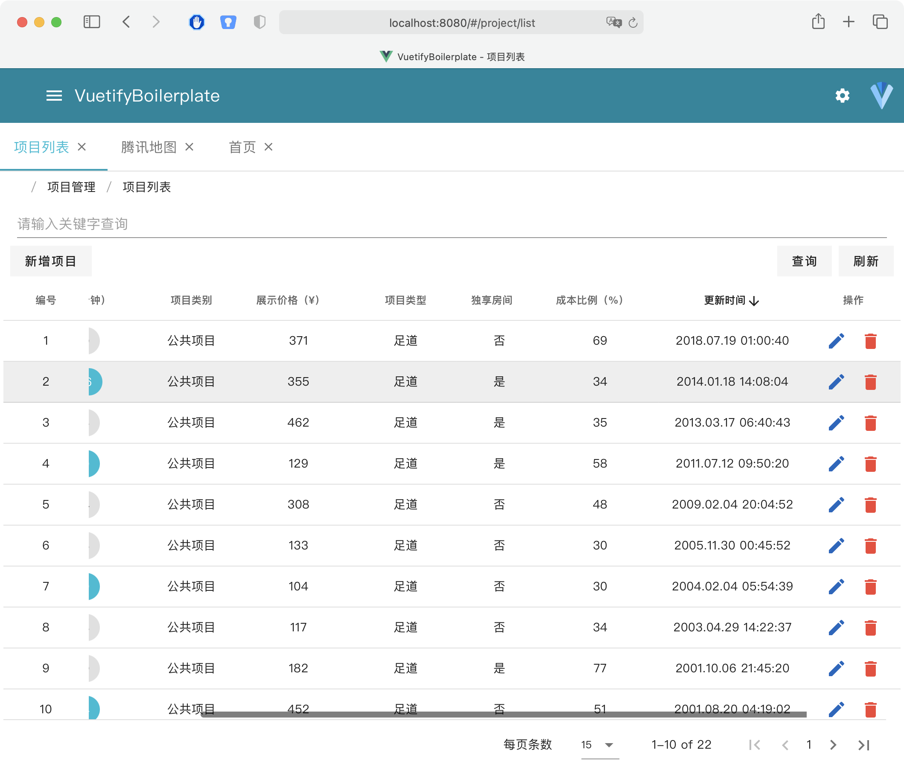
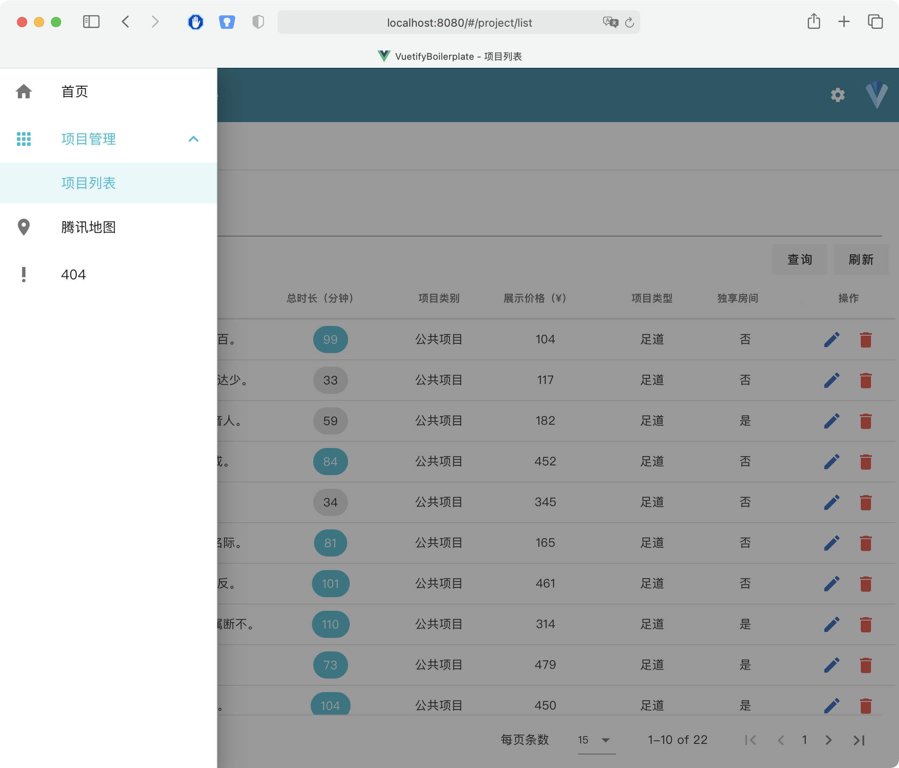
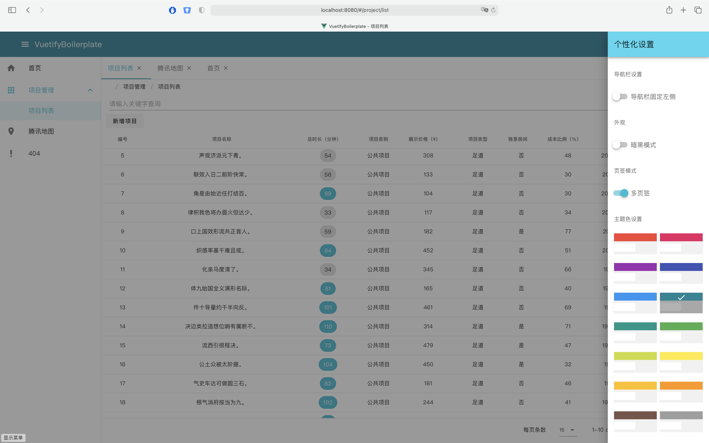
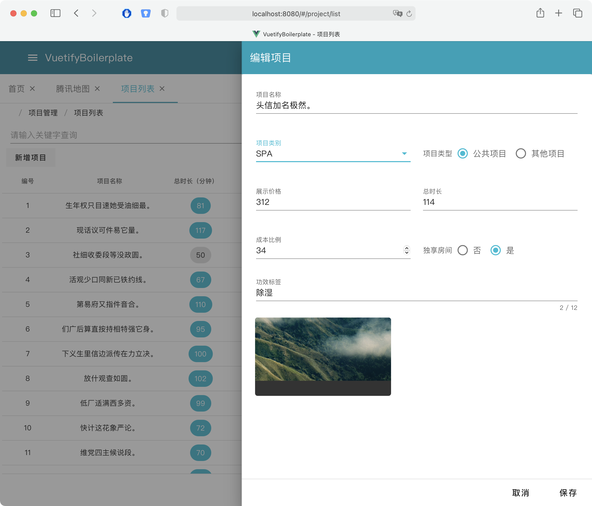

# @tanghongxin/VuetifyBoilerplate

An out of box boilerplate based on vuetify with multiple preset enhancement.

## Features

- Multiple RouterView Tabs and keep-alive
- Multiple built-in themes
- Dark mode
- Permissions control
- Auto routes and menus generated by permissions
- Auto document title generated by router
- Persistence vuex
- Preset config for bundle reducing and tree-shaking
- Preset CDN config in production mode
- Preset axios config with jwt and authorization
- Preset global sass variable entry config
- Simple TencentMap component wrapper with ```@vue/composition-api```

## Enhancement for Vuetify

- Programmatic toast
- Fixed  column in Table
- VLoading component
- VImgUpload component
- VFollowMnu component
- FormDrawer component

## Usage

```bash
git clone https://github.com/tanghongxin/VuetifyBoilerplate.git
cd VuetifyBoilerplate
npm i
npm run serve
```

## Preview


 <br />
 <br />
 <br />
 <br />
 <br />
